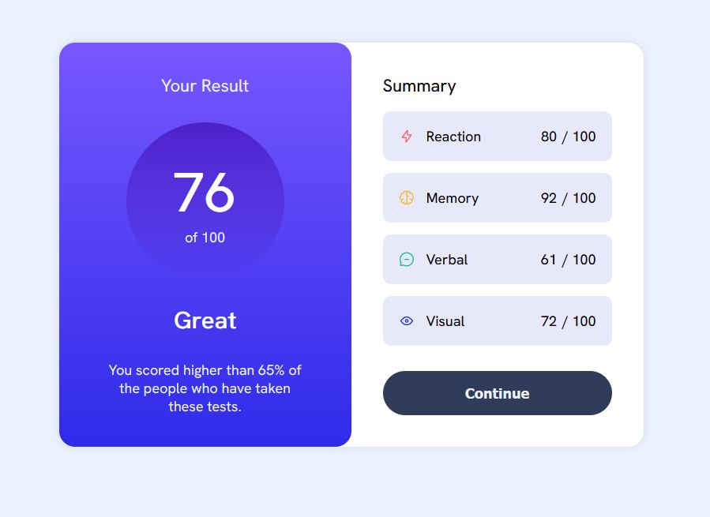

# Frontend Mentor - Results summary component solution

This is a solution to the [Results summary component challenge on Frontend Mentor](https://www.frontendmentor.io/challenges/results-summary-component-CE_K6s0maV). Frontend Mentor challenges help you improve your coding skills by building realistic projects. 

## Table of contents

- [Overview](#overview)
  - [The challenge](#the-challenge)
  - [Screenshot](#screenshot)
  - [Links](#links)
- [My process](#my-process)
  - [Built with](#built-with)
  - [What I learned](#what-i-learned)
  - [Continued development](#continued-development)
  - [Useful resources](#useful-resources)
- [Author](#author)
- [Acknowledgments](#acknowledgments)

**Note: Delete this note and update the table of contents based on what sections you keep.**

## Overview

### The challenge

Users should be able to:

- View the optimal layout for the interface depending on their device's screen size
- See hover and focus states for all interactive elements on the page

### Screenshot

### Links

- Solution URL: [Github Repository](https://github.com/tompbs/2023-FEM_resultsummary)
- Live Site URL: [github Pages](https://tompbs.github.io/2023-FEM_resultsummary/)

## My process

On this challenge I focused less on the exact matching of the design to focus on writing a js code in the functional paradigm.
I've been using the help of ChatGPT for most of the work - such a great ressource to learn!

### Built with

- HTML
- CSS 
- Javascript

### What I learned

TBD...

### Continued development

For the next project I want to try larger designs not just an element.

### Useful resources

- [ChatGPT](https://chat.openai.com) - This helped me along the way to learn new functions, improve my code, breakdown some code, manage errors.

## Author

- Frontend Mentor - [@tompbs](https://www.frontendmentor.io/profile/tompbs)

## Acknowledgments

Special thanks to JBGrill for his help on learning the functional paradigm
